# AnkitGundewar
Hi There! My name is Ankit Gundewar , an aspiring computer scientist with a deep interest in Machine Learning, Artificial Intelligence and Generative AI, and am <mark>Artificial Intelligence</mark> graduate from <mark>Northeastern University</mark>. As a student, automating systems to make lives easier always fascinated me and prompted me to delve deeper into the field. I have learnt and worked with Python, Java, C, C++, PyTorch and RPA to create and complete projects in Process Automation, Computer Vision, Natural Language Processing, Neural Networks and Artificial Intelligence. Recently I have developed an interest in Cloud Systems and DevOps for diversified computing through multi-cloud and hybrid models to ensure optimal performance in AI. I am currently looking for suitable work opportunities in the above fields and implore you to go though my tech stack below and look me up on LinkedIn. Thanks :) 
## 🛠️ Tech Stack

  
  
  
  
  

   

  
  
  
  
  

   

  
  
  
  
  

   

  
  
  
  
  

 

  

## ⚙️ GitHub Analytics  

  

P.S: Don't believe the stats, I'm very active here :)
 
  
## 🤝 Connect with Me

  
  
  

